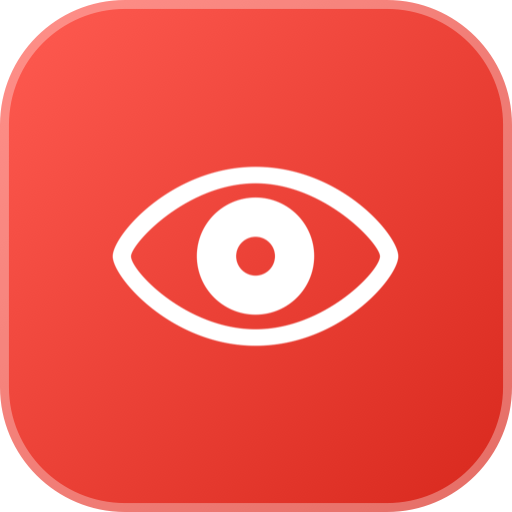
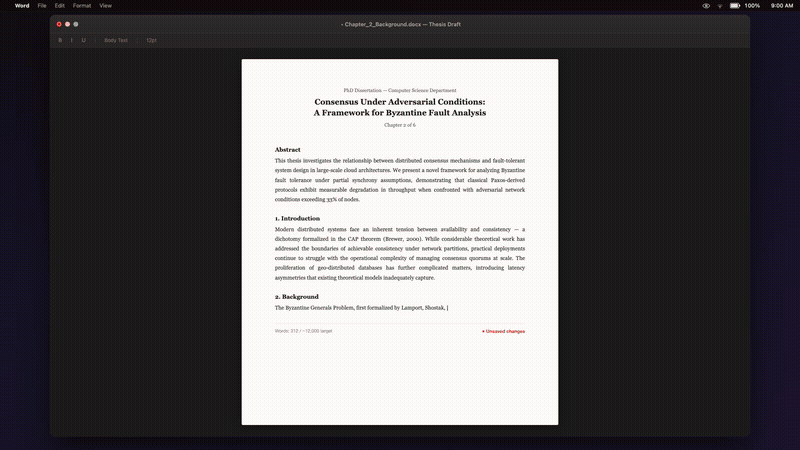

<div align="center">
    
    <h1>redeye</h1>
  <p><strong>A macOS menu bar app that tints your display red as your battery runs low — so you never get surprised by a dead laptop.</strong><br>
    <!-- Inspired by a Hammerspoon script of the same name. -->
  </p>
</div>



## How it works

When your battery drops below 10%, redeye fades a red overlay across all connected displays. The overlay intensifies as the battery drains further. Plugging in clears it immediately.

## Features

- Red overlay that intensifies with battery drain
- Multi-display support
- Launch at login
- Auto-updates via Sparkle
- Optional menu bar icon (hide it and use the dock instead)

## Install

Download the latest release from the [Releases](../../releases) page, unzip, and drag `redeye.app` to your Applications folder.

> **Note:** Release builds are ad-hoc signed (not notarized). On first launch, right-click the app and choose Open to bypass Gatekeeper.

## Development

```sh
make setup   # install swiftlint + swiftformat, activate git hooks
make preview # kill any running redeye, build Release, open the app
```

`make setup` only needs to be run once per clone. It installs the required tools via Homebrew and points git at the `.githooks/` directory, which runs SwiftFormat + SwiftLint on commit and a Debug build on push.

<!--
## Publishing

```sh
make publish-patch
make publish-minor
make publish-major
```

Bumps the version, builds, commits, creates a `vMAJOR.MINOR.PATCH` tag, and pushes. The tag triggers a GitHub Actions workflow that produces `redeye.zip`, `redeye.dmg`, and `appcast.xml`.

Use `scripts/release.sh 1.2.3` for a specific version, or `scripts/release.sh patch --dry-run` to preview.
The release workflow requires one GitHub repository secret:

| Secret | Description |
|---|---|
| `SPARKLE_PRIVATE_KEY` | Ed25519 private key generated by `build/SourcePackages/artifacts/sparkle/Sparkle/bin/generate_keys` |

The matching public key is embedded in `redeye/Info.plist` as `SUPublicEDKey`.
-->

## Requirements

- macOS 13 Ventura or later
